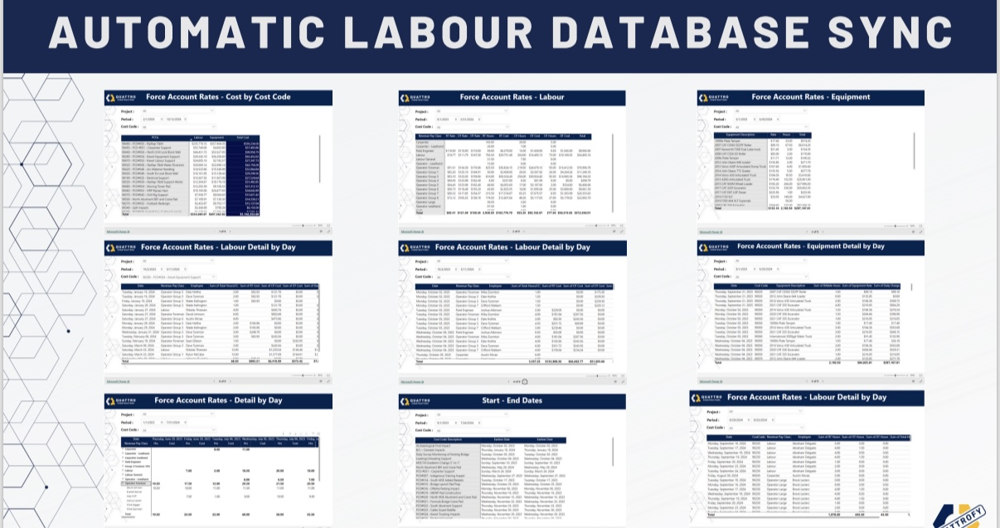

# 💼 Project Costing Data Flow

## 🧭 Overview
This Microsoft Power Automate Flow is designed to pull project, labor, and equipment cost data from the Operations Open API and transform it into rich, interactive Power BI dashboards. These dashboards provide a detailed breakdown of force account rates and help stakeholders analyze cost performance, labor utilization, and project timelines.

## 💡 Objective
To automate the collection of critical financial and operational data from the Operations system and present it through detailed, filterable dashboards for use by project controls, accounting, and executive teams.

### Flow

### Dashboard

---

## ✨ Key Features
- Scheduled flow to call REST API endpoints
- JSON transformation and normalization
- Inserts into Azure SQL Server for reporting
- Power BI dashboards for force account rate analysis and cost tracking

---

## 📊 Power BI Dashboards
This system powers over **9 dashboards**, including:

1. **Force Account Rates – Cost by Cost Code**
   - Breakdown of total costs per cost code across all projects
   - Bar chart, table, and cumulative cost views

2. **Force Account Rates – Labor Overview**
   - Summary of labor hours, costs, and rates
   - Filters by project, trade, and role

3. **Force Account Rates – Equipment Overview**
   - Summary of equipment usage and cost per unit
   - Drilldowns into specific categories (e.g., heavy machinery)

4. **Labor Details by Day**
   - Timeline view of labor costs per day, per project
   - Useful for comparing budget vs. actual

5. **Equipment Details by Day**
   - Daily cost tracking for each equipment type
   - Date and project filters available

6. **Force Account Rate – Full Detail by Day**
   - Combines labor, equipment, and material into one unified timeline view

7. **Start and End Dates Tracker**
   - Tracks project start and end dates
   - View overlaps and inactive gaps

8. **Project Summary Costs**
   - Total costs by category per project
   - Budget alignment view

9. **KPI & Metric Dashboards**
   - Variance, utilization efficiency, top cost drivers, etc.

---

## ⚙️ Tech Stack

| Category            | Technologies |
|---------------------|--------------|
| **Automation**      |  |
| **API Integration** |  |
| **Database**        |  |
| **Visualization**   |  |
| **Hosting**         |  |

---

## 🔄 Flow Logic
1. **Trigger:** Recurring schedule (e.g., every 4 hours)
2. **API Calls:** Retrieve data from Operations system
3. **Transform:** Normalize data structures, apply business logic
4. **Store:** Insert into Azure SQL with staging and final tables
5. **Log:** Track each flow run, including records inserted and failures

---

## 📈 Business Impact
- ⏱️ Saved hours of manual reconciliation work for finance teams
- 📊 Enabled real-time access to performance dashboards
- 🧩 Facilitated tighter alignment between Operations and Accounting
- 🔍 Identified costly trends earlier with up-to-date data

---

## 🤝 Collaboration
- Worked in partnership with the **Project Controls Manager** and **Finance Team**
- Data models designed for **Power BI optimization**
- Continuous improvement from feedback loops and new requirements

---

## 🔗 Related Projects
- `Quattrofy` – Main ERP Web Application
- `Sync Project Data Flow` – Master flow that triggers syncs
- `Equipment API Dashboards` – Equipment utilization analytics
- `Safety API Dashboards` – Incident and FLHA reports
